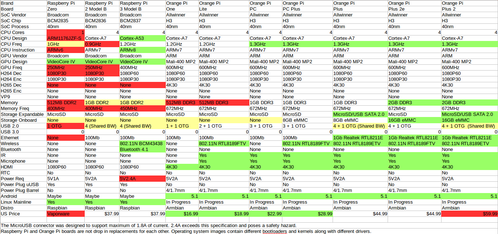

# Orange (Raspberry подобная плата).
Самая засада что апельсинка не питается от mini-usb,<br>
ей нужен адаптер с разёмом DC 4.0x1.7, <br>
или подать питание на GPIO(5v и GND).
## Модели


## GPIO


# Установка.
## Прошиваем SD.
Ходим на www.armbian.com и скачиваем образ ос <br>
Armbian Buster - Основан на Linux Debian <br>
Armbian Bionic - Основан на Linux Ubuntu <br>
естественно скачиваем Armbian Buster <br>
Всё тем же balenaEtcher заливаем образ на SD-card. <br>
## Монитор + клавиатура.
такого подарка как в малинке(файловая система /boot FAT32), в апельсинке нет. <br>
естественно монтировать ext к форточке лень,<br>
так что подключаем моник и клаву к апельсинке.<br>
login: root <br>
pass: 1234 <br>
сразу принуждение сменить пароль root(регистр+8символов)<br>
после смены пароля, будет предложено создать пользователя(от предложения можно отказатся <Ctrl+C>)<br>
логинимся root<br>

### Если нет DHCP.
sudo armbian-config <br>
```
> Network
> IP
> <Static>
> <OK>
> <Back>
> <Exit>
```
### Если по какой то причине, в прошлом пункте, что то пошло не так.

nano /etc/network/interfaces
```
allow-hotplug eth0
iface eth0 inet static
address 192.168.0.1
netmask 255.255.255.0
gateway 192.168.0.254
dns-nameservers 192.168.0.253
```
```
[Ctrl]+[x] - закрываем файл,<br>
[y] - сохраняем,<br>
[Enter] - туда же.<br>
```
```
systemctl restart networking.service
ifup eth0
```
## Подключаемся по SSH.
```
echo nameserver 8.8.8.8 > /etc/resolv.conf
apt install mc -y
nand-sata-install
```
```
[Enter] - да перенести все c SD на eMMC.
[Enter] - да я понимаю что вся инфа на eMMC затрется.
[Enter] - выбор файловой системы.
<Power off>
```
Отключаем питание, <br>
вынимаем SD-card, <br>
подключаем питание. <br>
Установка завершена. =)<br>
### Fork + Git
    1. создаём локальную папку репозитория. (не забываем про General settings).
    2. Fork, инициализируем локальный репозиторий(из пункта 1).
    3. создаём внешний репозиторий(git).
    4. Fork, инициализируем внешний репозиторий(из пункта 3).
    5. создаём 'readme.md'
    6. создаём коммит 'init: master' и пушим изменения.(master ветка создана локално и origin).
    7. инициализируем 'git flow'.
    8. переходим в ветку 'develop'.
    9. пишем название проекта(или что угодно) в 'readme.md'.
    10. создаём коммит 'init: develop' и пушим изменения.(develop ветка создана локално и origin).
    11. создаём ветку 'feature/govnokod', и начинаем творить(по возможности пишем: локоничные 'коммиты' и исчерпывающие 'дискрипшены').