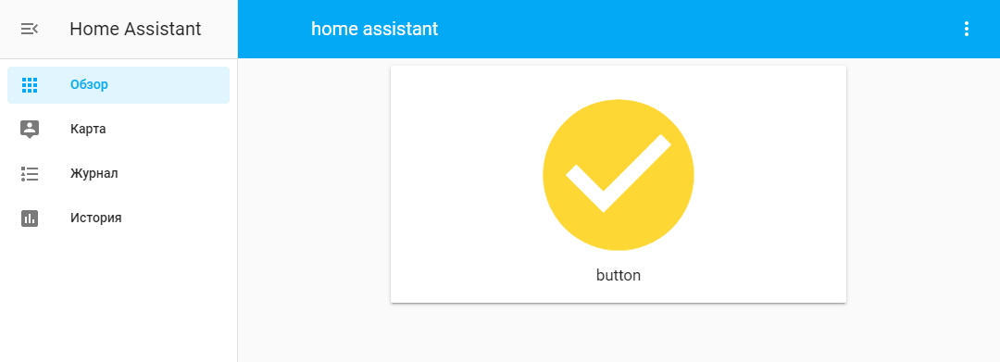

# ВНИМАНИЕ: на моей сборке сенсор залипает. 
## (то же самое в python3.7 работает нормально)

# ./configuration.yaml

```
default_config:

tts:
  - platform: google_translate

group: !include groups.yaml
automation: !include automations.yaml
script: !include scripts.yaml
scene: !include scenes.yaml

lovelace:
    mode: yaml

binary_sensor:
  - platform: rpi_gpio
    invert_logic: true
    pull_mode: UP
    bouncetime: 50
    ports:
      17: button
```
# ./ui-lovelace.yaml
```
title: home assistant
views:
  - title: Кнопка
    icon: mdi:gesture-tap-button
    cards:
    - type: button
      entity: binary_sensor.button
```