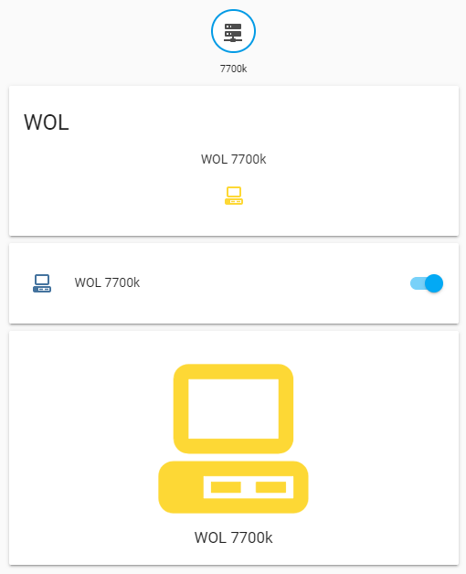

# ./configuration.yaml

```
default_config:

tts:
  - platform: google_translate

group: !include groups.yaml
automation: !include automations.yaml
script: !include scripts.yaml
scene: !include scenes.yaml

lovelace:
    mode: yaml

binary_sensor:
  - platform: ping
    host: 192.168.0.1
    name: 7700k
    count: 2
    scan_interval: 60

switch:
  platform: command_line
    switch_wol:
      command_on: 'python3 /srv/homeassistant/scripts/switch_wol.py on 192.168.0.1 MA-C0-AD-DR-ES-S0'
      command_off: ''
      command_state: 'python3 /srv/homeassistant/scripts/switch_wol.py state 192.168.0.1 MA-C0-AD-DR-ES-S0'
      value_template: '{{ value == "1" }}'
      friendly_name: WOL 7700k
```
# ./switch_wol.py
```
#!/usr/bin/python3
from wakeonlan import send_magic_packet
import sys

def ping(ip):
    import os
    return int(not bool(os.system("ping -c 1 " + ip + " > /dev/null")))

if __name__ == "__main__":
  if len(sys.argv) == 4:
    ip = sys.argv[2]
    mac = sys.argv[3]
    if sys.argv[1] == 'off':
      pass
    elif sys.argv[1] == 'on':
      send_magic_packet(mac)
    elif sys.argv[1] == 'state':
      print(ping(ip))
  else:
    print('Кол-во аргументов, не равно трём.')
    print('Пример: switch_wol.py on 192.168.0.1 MA-C0-AD-DR-ES-S0')
    print(sys.argv)
```
# ./ui-lovelace.yaml
```
title: home assistant
views:
  - title: wol
    icon: mdi:file-swap-outline
    badges:
     - entity: binary_sensor.7700k
       tap_action:
         action: call-service
         service: switch.turn_on
         service_data:
            entity_id: switch.switch_wol
       hold_action:
         action: more-info
    cards:
      - type: glance
        title: WOL
        show_state: false
        entities:
          - entity: switch.switch_wol
            tap_action:
              action: call-service
              service: switch.turn_on
              service_data:
                entity_id: switch.switch_wol
            hold_action:
              action: more-info
      - type: entities
        show_header_toggle: false
        entities:
        - entity: switch.switch_wol
      - type: entity-button
        entity: switch.switch_wol

```