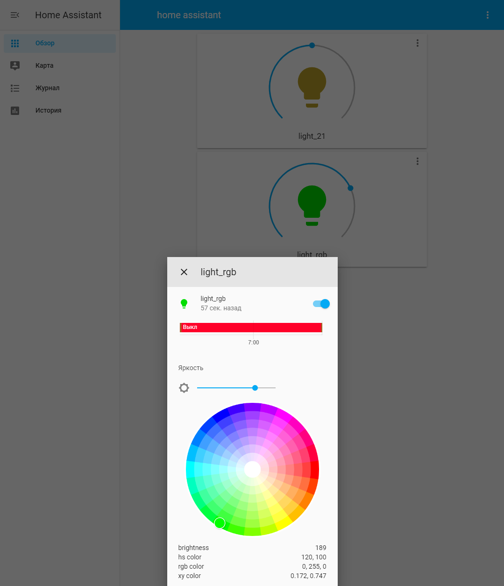

# ./configuration.yaml

```
default_config:

tts:
  - platform: google_translate

group: !include groups.yaml
automation: !include automations.yaml
script: !include scripts.yaml
scene: !include scenes.yaml

lovelace:
    mode: yaml

#sudo pigpiod (команда должна быть выполнена перед запуском home assistant).
light:
  - platform: rpi_gpio_pwm
    leds:
      - name: light_rgb
        driver: gpio
        pins: [10,9,11]
        type: rgb

  - platform: rpi_gpio_pwm
    leds:
      - name: light_21
        driver: gpio
        pins: [21]
        type: simple
```
# ./ui-lovelace.yaml
```
title: home assistant
views:
  - title: Свет
    icon: mdi:gceiling-light
    cards:
    - type: light
      entity: light.light_21
      name: light_21
    - type: light
      entity: light.light_rgb
      name: light_rgb

```