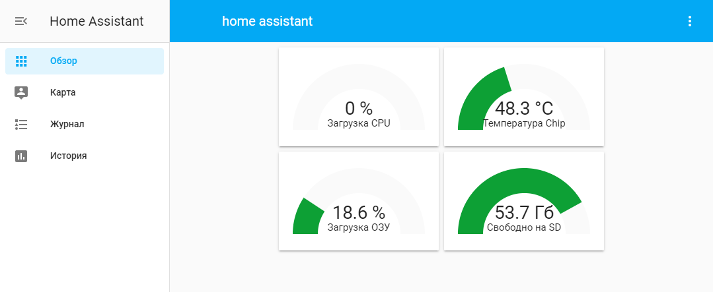

# ./configuration.yaml

```
default_config:

tts:
  - platform: google_translate

group: !include groups.yaml
automation: !include automations.yaml
script: !include scripts.yaml
scene: !include scenes.yaml

lovelace:
    mode: yaml

sensor: 
  - platform: systemmonitor
    resources:
    - type: processor_use
    - type: memory_use_percent
    - type: disk_free
      arg: /

  - platform: command_line
    name: Chip температура.
    command: "sudo /opt/vc/bin/vcgencmd measure_temp"
    unit_of_measurement: "°C"
    value_template: '{{ value | replace("temp=", "") | replace("''C", "") }}'
```
# ./ui-lovelace.yaml
```
title: home assistant
views:
  - title: local host
    icon: mdi:desktop-tower
    cards:
    - type: horizontal-stack
      cards:
      - type: gauge
        name: Загрузка CPU
        unit: "%"
        entity: sensor.processor_use
        severity:
          green: 0
          yellow: 60
          red: 85
      - type: gauge
        name: Температура Chip
        unit: "°C"
        max: 120
        entity: sensor.chip_temperatura
        severity:
          green: 0
          yellow: 80
          red: 100
    - type: horizontal-stack
      cards:
      - type: gauge
        name: Загрузка ОЗУ
        unit: "%"
        entity: sensor.memory_use_percent
        severity:
          green: 0
          yellow: 60
          red: 85
      - type: gauge
        name: Свободно на SD
        unit: "Гб"
        max: 64
        entity: sensor.disk_free
        severity:
          green: 50
          yellow: 12
          red: 4
```