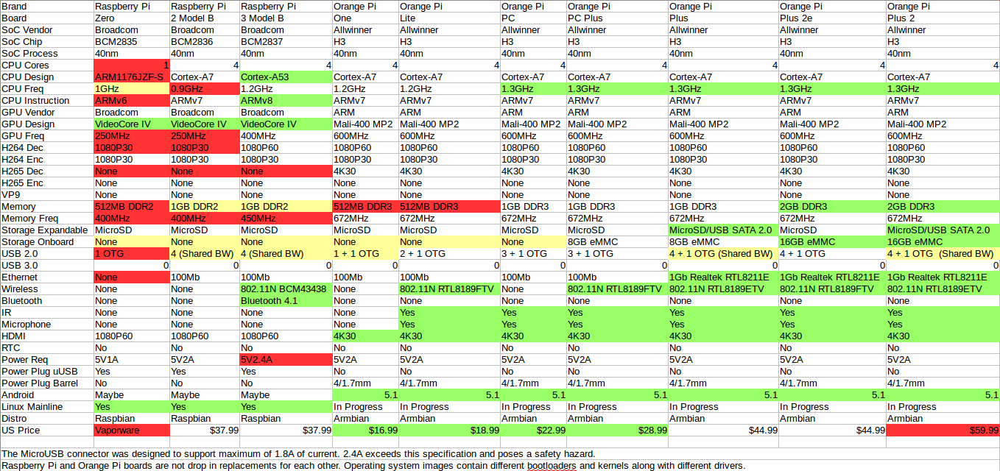
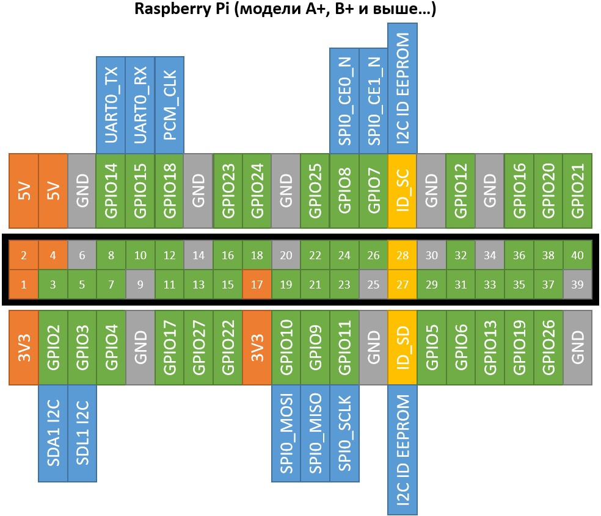

# Репозиторий общего назначения Raspberry.

## Модели

| Модель | Год выпуска | CPU | core | GPU | RAM | WiFi BT | LAN | USB | Audio | Video | GPIO |
| :---: | :---: | :---: | :---: | :---: | :---: | :---: | :---: | :---: | :---: | :---: | :---: |
| Pi 1 A | 2013 | Broadcom BCM2835 | 1x700 | VC_4 | 0.25 | - | - | 1 | I²S, HDMI, 3.5 jack | HDMI, RCA | 26 |
| Pi 1 A+ | 2014 | Broadcom BCM2835 | 1x700 | VC_4 | 0.25 | - | - | 1 | I²S, HDMI, 3.5 jack | HDMI, TRRS | 40 |
| Pi 1 B | 2012 | Broadcom BCM2835 | 1x700 | VC_4 | 0.5 | - | 100 | 2 | I²S, HDMI, 3.5 jack | HDMI, RCA | 26 |
| Pi 1 B+ | 2014 | Broadcom BCM2835 | 1x700 | VC_4 | 0.5 | - | 100 | 4 | I²S, HDMI, 3.5 jack | HDMI, TRRS | 40 |
| Pi 2 B | 2015 | Broadcom BCM2836 | 4x900 | VC_4 | 1 | - | 100 | 4 | I²S, HDMI, 3.5 jack | HDMI, TRRS | 40 |
| Pi 3 A+ | 2018 | Broadcom BCM2837B0 | 4x1400 | VC_4 | 0.5 | 802.11ac 4.2 | - | 1 | I²S, HDMI, 3.5 jack | HDMI, TRRS, DSI | 40 |
| Pi 3 B | 2016 | Broadcom BCM2837 | 4x1200 | VC_4 | 1 | 802.11n 4.1 | 100 | 4 | I²S, HDMI, 3.5 jack | HDMI, TRRS, DSI | 40 |
| Pi 3 B+ | 2018 | Broadcom BCM2837B0 | 4x1400 | VC_4 | 1 | 802.11ac 4.2 | 1000 | 4 | I²S, HDMI, 3.5 jack | HDMI, TRRS, DSI | 40 |
| Pi Zero | 2015 | Broadcom BCM2835 | 1x1000 | VC_4 | 0.5 | - | - | 1 | mini HDMI, GPIO PWM | mini HDMI, GPIO Composite | 40 |
| Pi Zero W | 2017 | Broadcom BCM2835 | 1x1000 | VC_4 | 0.5 | 802.11n 4.0 | - | 1 | mini HDMI, GPIO PWM | mini HDMI, GPIO Composite | 40 |
| Pi 4 B | 2019 | Broadcom BCM2711 | 4x1500 | VC_6 | 1,2,4 | 802.11ac 5.0 | 1000 | 2-2.0, 2-3.0 | I²S, 2 micro HDMI, 3.5 jack | 2 micro HDMI, TRRS, DSI | 40 |


## GPIO


## раздел /boot/

### Включить SSH.
Создаём файл /boot/ssh
### Настрока ip eth0, если нет DHCP(отменяет dhcpcd.conf, из ОС после настройки dhcpcd.conf, строку стоит удалить.).
В файл cmdline.txt, в конец строки, через пробел добавляем строку.
```
ip=10.0.0.1::10.0.0.254:255.255.255.0:rpi:eth0:off
```
10.0.0.1 - ip адрес. <br>
10.0.0.254 - шлюз. <br>
255.255.255.0 - маска. <br>
rpi - ХЗ. <br>
eth0 - интерфейс. <br>
off - ХЗ. <br>

### Включить Wi-Fi (рекомендуется настрока 2.4 Ghz).
Создаём файл /boot/wpa_supplicant.conf
```
ctrl_interface=DIR=/var/run/wpa_supplicant GROUP=netdev
update_config=1
country=RU
network={
        ssid="Wi-Fi"
        psk="password"
        scan_ssid=1
}
```
ssid="Wi-Fi" - Подключится к wi-fi сети с SSID "Wi-Fi". <br>
psk="password" - пароль для подключения "password". <br>
scan_ssid=1 - опрос скрытых сетей. <br>

## Raspbian ОС.

### Первый запуск.
прописываем сеть.
```
sudo -s
echo interface eth0 >> /etc/dhcpcd.conf
echo static ip_address=10.0.0.1/24 >> /etc/dhcpcd.conf
echo static routers=10.0.0.254 >> /etc/dhcpcd.conf
echo static domain_name_servers=8.8.8.8 >> /etc/dhcpcd.conf
ifconfig eth0 down && ifconfig eth0 up
apt install mc -y
```
Удаляем информацию о сети из файла /boot/cmdline.txt (если она туда вносилась). <br>

### Сети.

#### Ethernet.
Редактируем файл /etc/dhcpcd.conf <br>
Выключить ipv6 (выключаем всем и включаем на интерфейсе int0). <br>
```
noipv6
interface int0
ipv6
```
Простая настройка. <br>
```
interface eth0
static ip_address=10.10.10.10/24
static routers=10.10.10.254
static domain_name_servers=8.8.8.8
```
Настройка на основе найденого маршрутизатора. <br>
```
interface eth0
arping 192.168.0.254
arping 10.0.0.254

profile 192.168.0.254
static ip_address=192.168.0.1/24
static routers=192.168.0.254
static domain_name_servers=192.168.0.252

profile 10.0.0.254
static ip_address=10.0.0.1/24
static routers=10.0.0.254
static domain_name_servers=10.0.0.252
```
На случай если нет не маршрутизатора не dhcp. <br>
```
interface eth0
arping 192.168.1.1
fallback mylan

profile 192.168.1.1
static ip_address=192.168.1.99/24
static routers=192.168.1.1
static domain_name_servers=192.168.1.1

profile mylan
static ip_address=192.168.0.99/24
```
Добавить псевдоним. <br>
/etc/network/interfaces.d/eth00 <br>
```
auto eth0:0
allow-hotplug eth0:0
iface eth0:0 inet static
       address 10.11.12.34
       netmask 255.255.255.0
       network 10.11.12.0
       gateway 10.11.12.254
       metric 20
```
#### Wi-Fi.
проверка блокировок.
```
sudo rfkill list all 
```
если есть '*blocked: yes', снимаем.

```
sudo rfkill unblock wifi
```
сканим ssid
```
sudo iwlist wlan0 scan | grep ESSID
```
Если нет нужного SSID и он при этом не скрытый (скрытые отображаются как ""), <br>
возможно нужный SSID работает в 5 Ghz диапазоне, смотрим частоты видимых сетей. <br>
```
sudo iwlist wlan0 scan | grep Frequency
```
Если нет 5 Ghz диапазона, меняем локализацию, на туже, что и у точки доступа. <br>
```
sudo raspi-config => [Localization Options] => [Change WiFi County] => (скорее всего RU или US)
или 
добовляем/редактируем строку country=RU(или US) в файле /etc/wpa_supplicant/wpa_supplicant.conf
```
Ждём секунд 10 и пробуем снова, если опять нету, меняем локаль на другую. <br>
```
sudo iwlist wlan0 scan | grep Frequency
или
sudo wpa_cli scan && sleep 5 && wpa_cli scan_results
```
Что бы не хранить пароль от wi-fi в открытом виде, сгенерируем хеш пароля (и пример конфигурации заодно).
``` 
wpa_passphrase SSID_сети парольная_фраза > /etc/wpa_supplicant/example.conf
```
копируем пример конфигурации из /etc/wpa_supplicant/example.conf <br>
в конец файла /etc/wpa_supplicant/wpa_supplicant.conf, <br>
если SSID скрытый, добавляем scan_ssid=1. <br>
должно получится примерно следующее.<br>
```
ctrl_interface=DIR=/var/run/wpa_supplicant GROUP=netdev
update_config=1
country=RU
network={
        ssid="SSID_сети"
        #psk="парольная_фраза"
        psk=7344ce9456b8fe58347c67eaaec505a6abfdc7b659ea2a66142b11badf17e48e
        scan_ssid=1
}
```
Не забываем удалить строку #psk="парольная_фраза" из файлов <br>
/etc/wpa_supplicant/wpa_supplicant.conf <br>
и <br>
/etc/wpa_supplicant/example.conf (example.conf можно весь удалить) <br>
```
wpa_cli -i wlan0 reconfigure
rm /var/run/wpa_supplicant/*
wpa_supplicant -B -i wlan0 -c /etc/wpa_supplicant/wpa_supplicant.conf
```
если увидели строку 'Successfully initialized wpa_supplicant', перезагружаем.
```
reboot
```
в тячении минуты после перезагрузки wlan0 должен получить ip по dhcp, <br>
если нужно задать статический ip, редактируем /etc/dhcpcd.conf аналогично настроке Ethernet(eth0). <br>

### Обновление.
```
udo apt-get update
sudo apt-get dist-upgrade
sudo apt-get upgrade
sudo rpi-update
```
### Root SSH
```
echo PermitRootLogin yes >> /etc/ssh/sshd_config 
sudo passwd
    pass
    pass
sudo systemctl enable ssh
sudo systemctl start ssh
```

### Подключаем LCD 3.5
```
raspi-config
    должно быть написано pi жмём [Enter]
    выбираем [3 Boot Options] жмём [Enter]
    выбираем [B1 Desktop / CLI] жмём [Enter]
    выбираем [B2 Console Autologin] жмём [Enter]
    выбираем <Finish> (для перехода вниз нажмите [Tab]) жмём [Enter]
    выбираем <No> жмём [Enter]
wget https://github.com/goodtft/LCD-show/archive/master.zip
unzip master.zip 
echo top >> /home/pi/.bashrc
cd LCD-show-master
./LCD35-show
```

### Fork + Git
    1. создаём локальную папку репозитория. (не забываем про General settings).
    2. Fork, инициализируем локальный репозиторий(из пункта 1).
    3. создаём внешний репозиторий(git).
    4. Fork, инициализируем внешний репозиторий(из пункта 3).
    5. создаём 'readme.md'
    6. создаём коммит 'init: master' и пушим изменения.(master ветка создана локално и origin).
    7. инициализируем 'git flow'.
    8. переходим в ветку 'develop'.
    9. пишем название проекта(или что угодно) в 'readme.md'.
    10. создаём коммит 'init: develop' и пушим изменения.(develop ветка создана локално и origin).
    11. создаём ветку 'feature/govnokod', и начинаем творить(по возможности пишем: локоничные 'коммиты' и исчерпывающие 'дискрипшены').